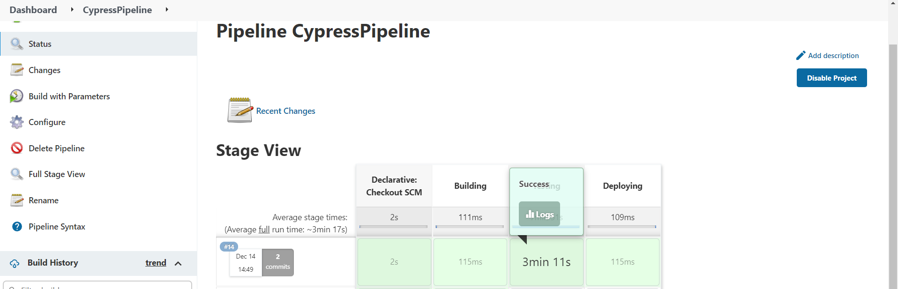
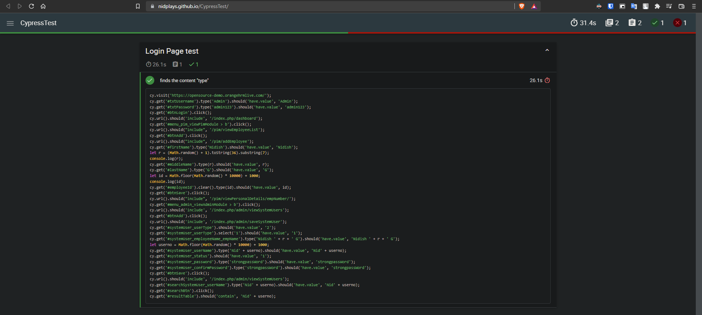

<h1> Cypress Testing Suite </h1>

This repo is for cypress testing (Internship)

Instructions to run the project
-
* Clone this repo.
* Install cypress and other dependencies.
* cd to ./databases and run **json-server --watch db-api.json**.
* in another terminal go to root dir and run  **npx cypress open**.
* Start testing in the Cypress GUI.

Project 1: Create dynamic data driven automated regression test script using Cypress for WholeSoft Market signup screen.

<a href="https://github.com/NidPlays/CypressTest/projects/1#card-74744377">Project Card Progress</a>

Below Screenshot shows the CI/CD Jenkins Pipeline Build and Output.

Below Screenshot shows when there is no failure in CI

Below Screenshot shows when the test fails and is updated in the GitHub pages website
